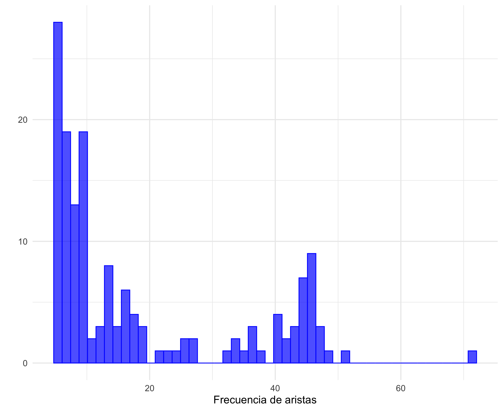
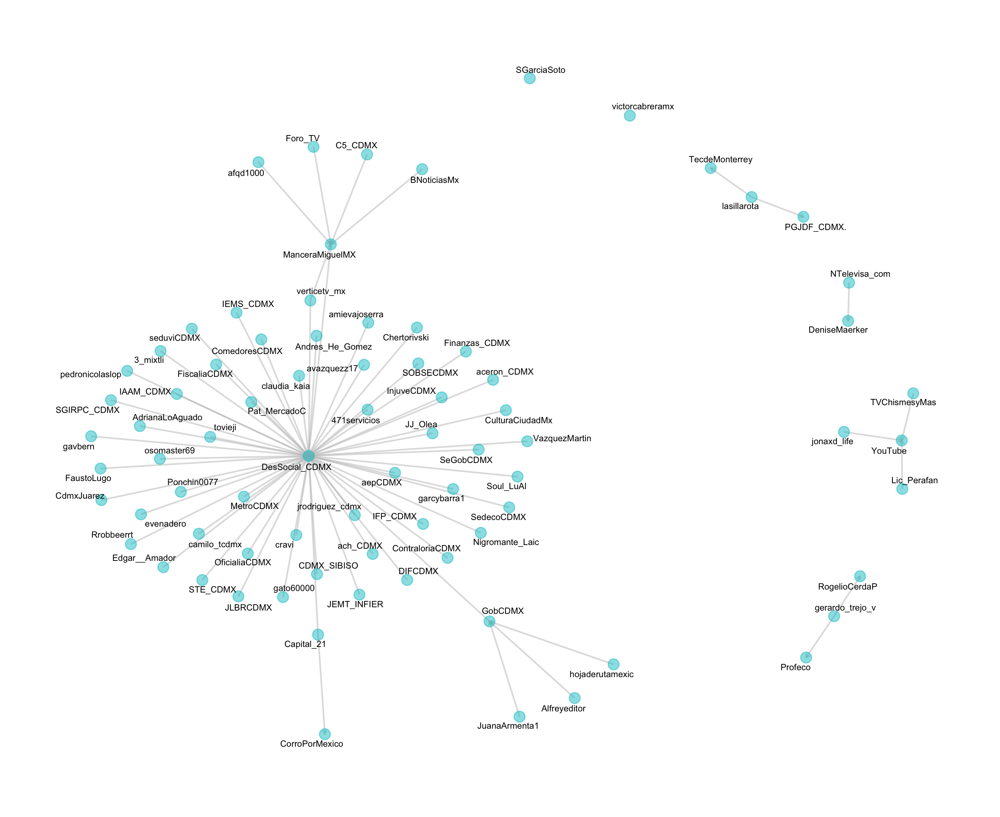
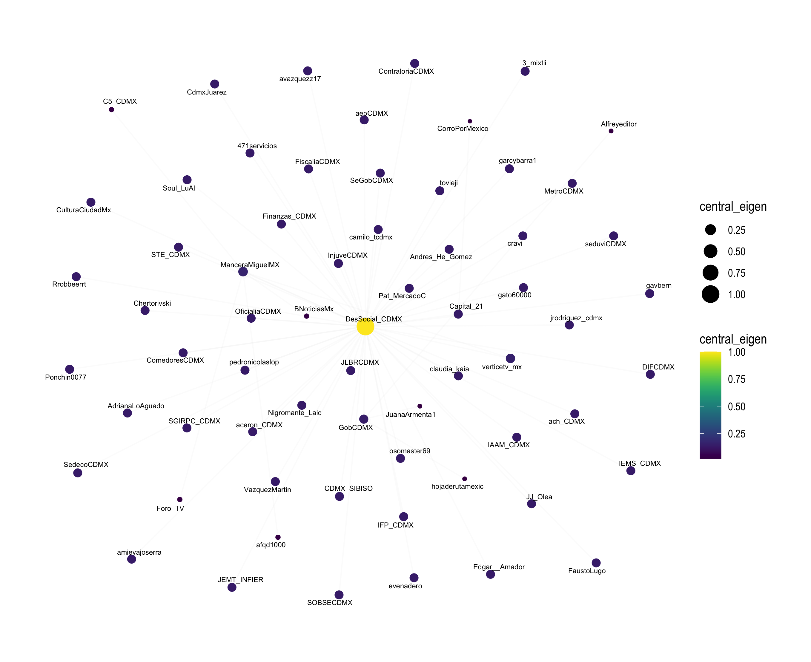
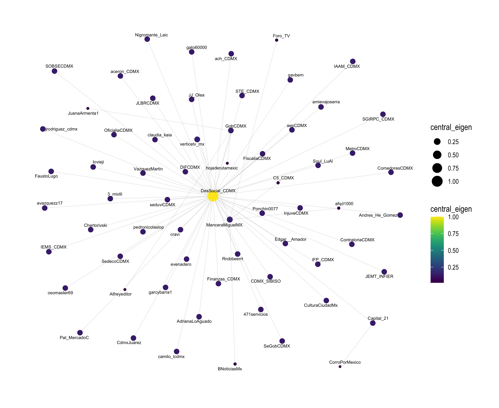
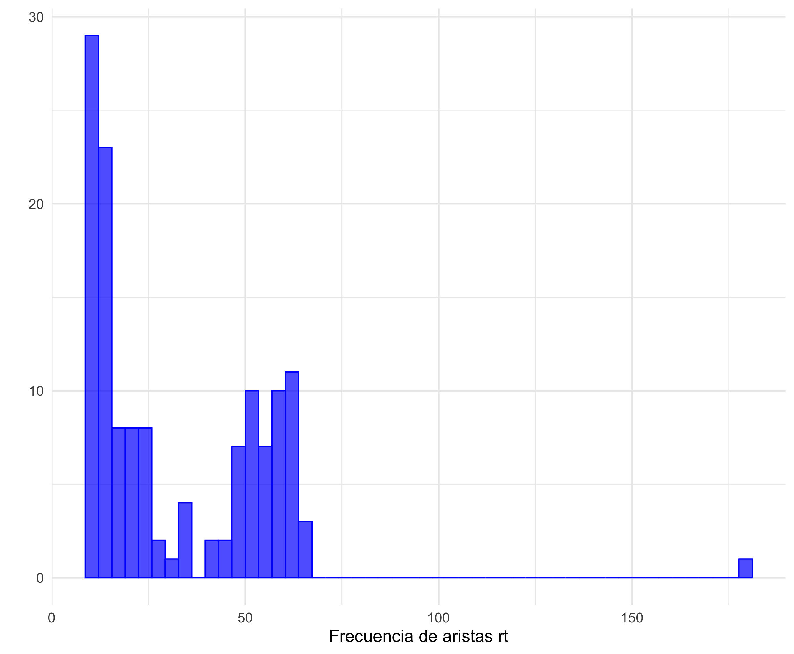
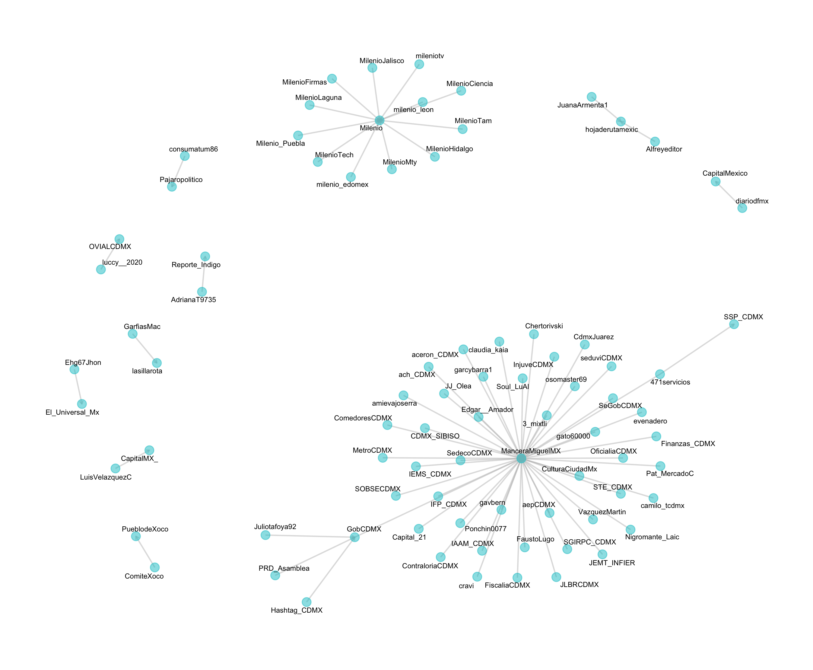
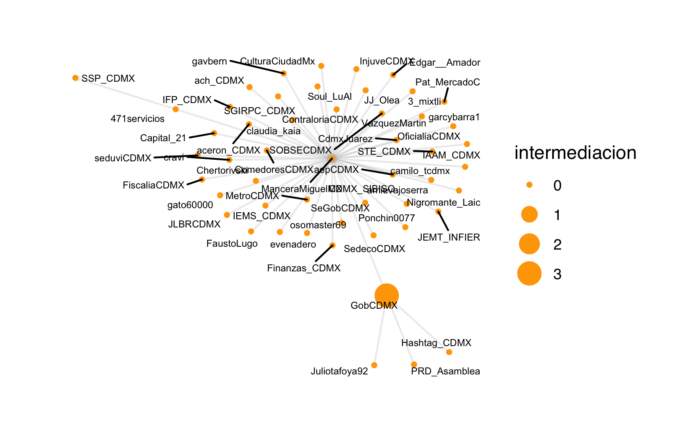
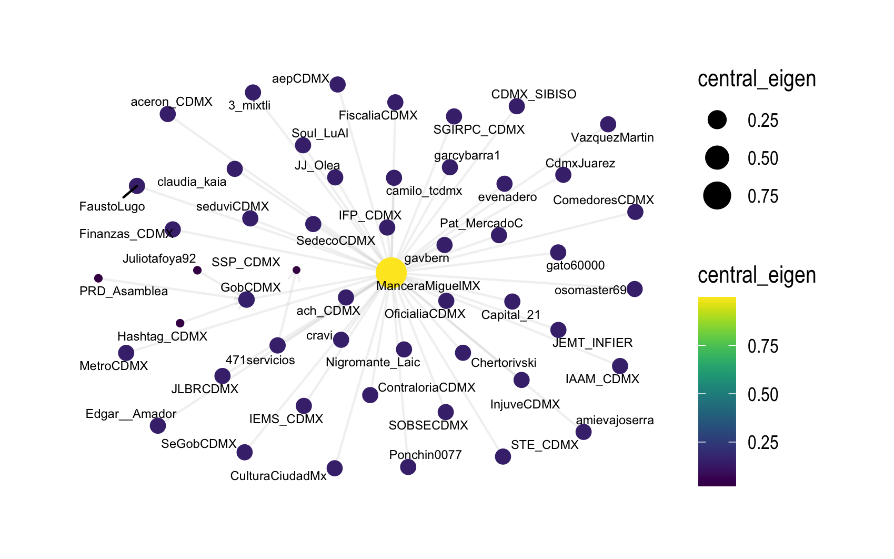

***
***

## 1. Introducción

Las redes sociales en periodos de emergencia ha incrementado su importancia por la rapidez de la comunicación y el alcance que tienen. Una de las redes sociales que más presencia tiene en este ámbito, es *Twitter*, debido a que la mayoría de entidades gubernamentales tienen una cuenta oficial por la cuál realizan comunicados. 

El análisis del comportamiento en redes sociales como *Twitter* puede realizarse de varias maneras. Una es estudiando las relaciones entre los diferentes usuarios para ver la importancia que tiene como usuario para comunicar a la comunidad en general. Otra forma de analizar este comportamiento, es analizando el contenido del mismo texto para ver el tipo de mensajes que la gente está transmitiendo, si son similares o difiren mucho entre ellos. 

Estas herramientas nos pueden ayudar a entender de manera amplia, el comportamiento de las personas en dicha red social, sobre todo en periodos de emergencia donde en crucial estar atentos a información oficial y verídica.

### 1.1. Objetivo

El objetivo del presente trabajo, es estudiar el comportamiento de *Twitter* en el sismo del 19 de septiembre del 2017 en la Ciudad de México. Este estudio se realizará con herramientas de análisis de texto, similitud de Jaccard y análisis de redes.

### 1.2. Metodología

Se realizó un *scrapping* de *Twitter*, obteniendo una llave lallala. 

Se descargaron alrededor de 80,000 *tweets* de los cuáles se obtuvimos **6XXXX observaciones únicas**. El contenido de la base tiene las siguientes columnas:

- created_at
- id
- author_id
- conversation_id
- referenced_tweets
- reply_to_user_id
- entities
- text
- username

## 2. Limpieza y análisis de texto

## 3. Similitud de Jaccard

## 4. Análisis de Redes

Para hacer el análisis de redes del presente trabajo, utilizamos:

- Los usuarios propietarios del *tweet*.
- Los usuarios que fueron mencionados en el *tweet*.
- Los usuarios que fueron retuiteados. 

Es decir, tenemos dos redes dirigidas una que va del usuario propietario al usuario mencionado, y otra que va del usuario propietario al usuario que retuitea.

#### Red dirigida de menciones

- Nodos: 12,011
- Aristas: 25,060

En la siguiente figura observamos un histograma de las aristas más repetidas, filtrando desde 5 para arriba:

En esta figura observamos que la frecuencia de aristas con menciones menores a 10, son muy grandes, por lo que utilizamos un filtro de menciones arriba de dicho número, para evitar tener conexiones con poca cantidad de menciones.

La siguiente figura es una representación de la red que muestra las conecciones entre los nodos.  

La siguiente figura presenta la red tomando en cuenta la medida de **intermediación**, que recordemos que nos proporciona una medida indicando qué tan único o importante es un nodo para conectar con otros nodos en la red. 

Medida de centralidad de eigenvector,

#### Red dirigida de retuits

- Nodos: 
- Aristas:

En esta figura observamos que la frecuencia de aristas con menciones menores a 10, son muy grandes, por lo que utilizamos un filtro de menciones arriba de dicho número, para evitar tener conexiones con poca cantidad de menciones.

La siguiente figura es una representación de la red que muestra las conecciones entre los nodos.  

La siguiente figura presenta la red tomando en cuenta la medida de **intermediación**, que recordemos que nos proporciona una medida indicando qué tan único o importante es un nodo para conectar con otros nodos en la red. 

Medida de centralidad de eigenvector,

#### Comparación de redes

***

***

17/05/2021 